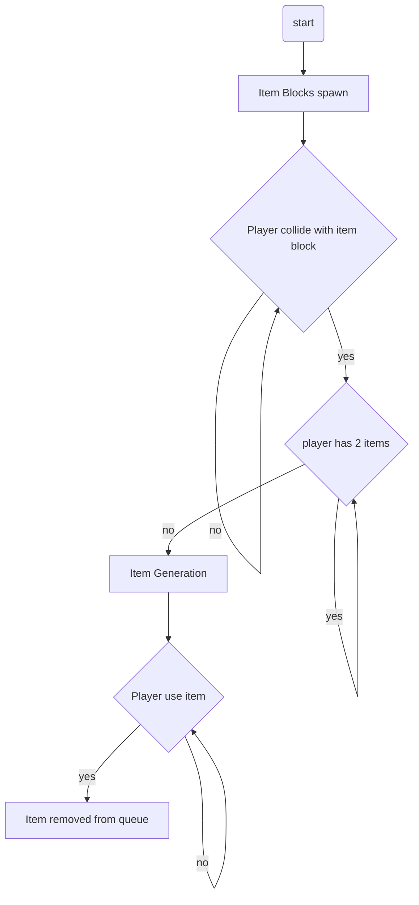

Item Blocks will spawn in random locations around the play area and the player has to collide with them to collect an item. When player collides a random number generator (1-10) will begin with each number corrosponding with an item. The player can have a max of 2 items at a time.

